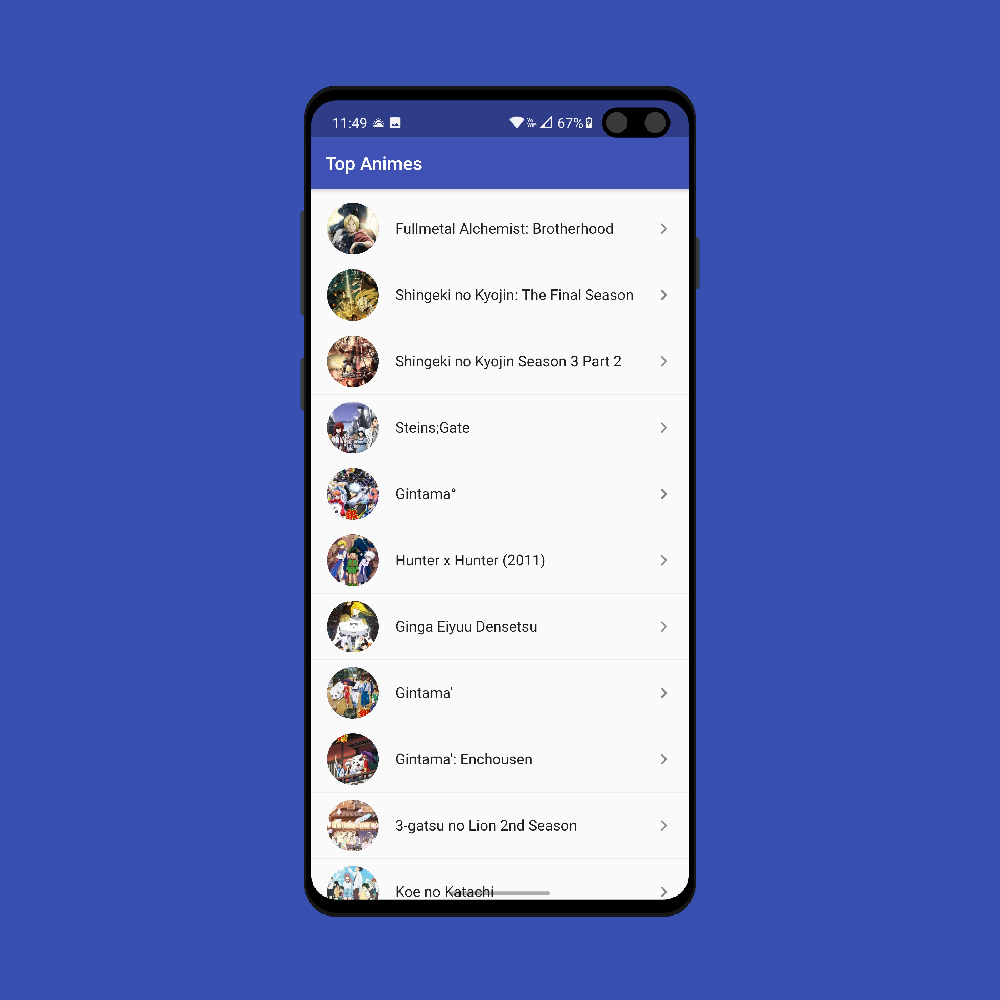
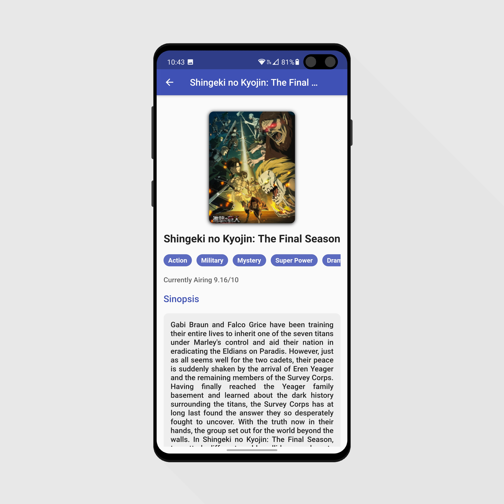

 

  <h1 align="center">Aplicación Final</h1>

    
    

 

<!-- ABOUT THE PROJECT -->

## Acerca del proyecto

Una aplicación desarrollada en Flutter para ver información de los animes más famosos, según MyAnimeList, utilizando la REST API de [Jikan](https://jikan.docs.apiary.io/#).

Ésta aplicación utiliza las librerias de:

- [Dio (peticiones http)](https://pub.dev/packages/dio)
- [Flutter Bloc (state management)](https://pub.dev/packages/flutter_bloc)
- [Injectable (dependency injection)](https://pub.dev/packages/injectable)
- [JSON serializable (serializar y deserializar JSON)](https://pub.dev/packages/json_serializable)
  

## Contacto

Fernando Maldonado - [@Fmaldonado4202](https://twitter.com/Fmaldonado4202) - fmaldonado824@gmail.com
